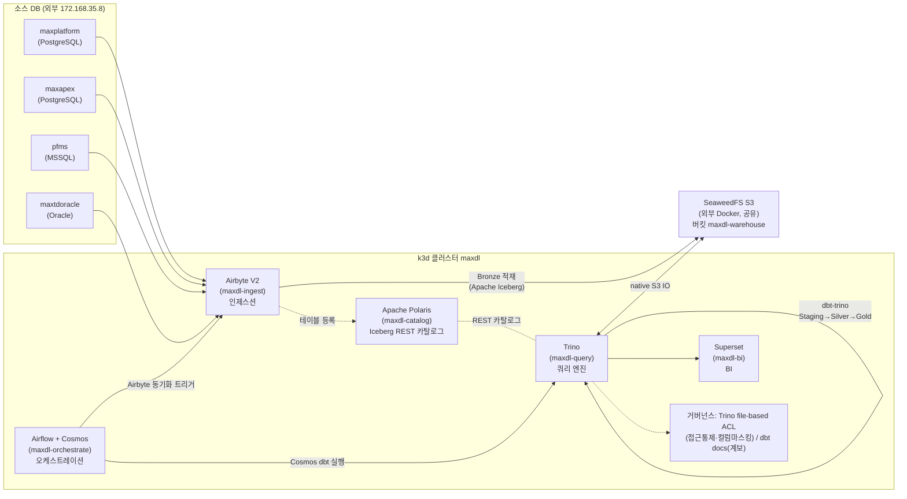
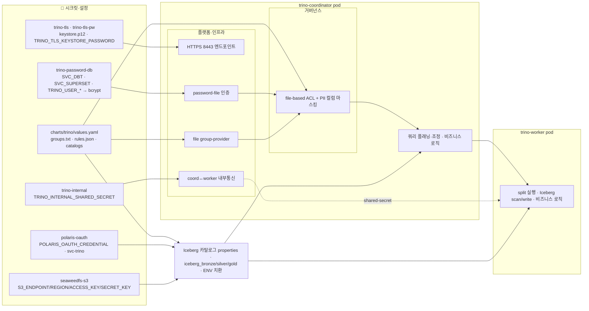
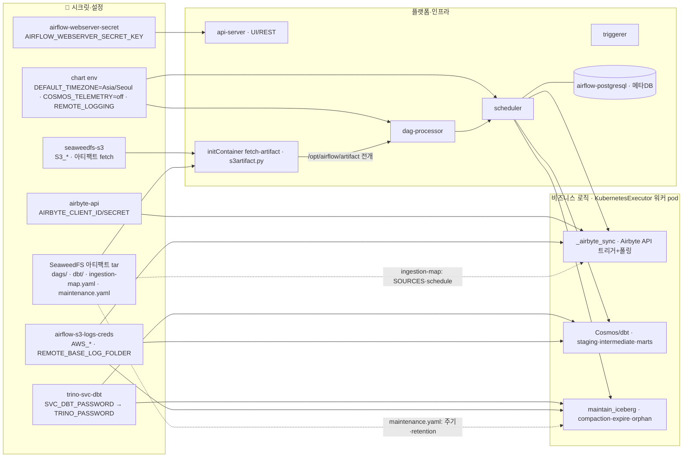
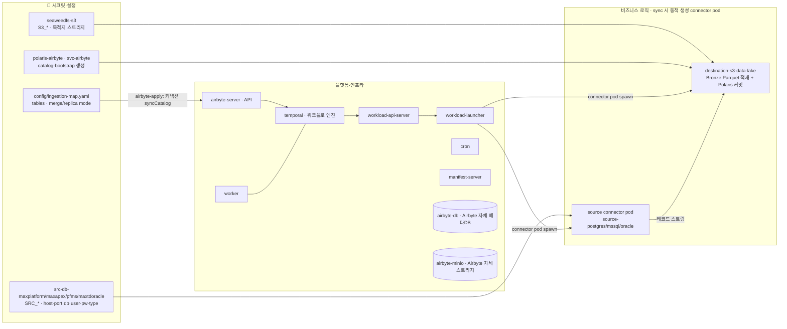

# maxdl 아키텍처 설명

> **한 줄 정의**: 제조(MES/LIMS/QMS/SPC) 데이터를 위한 100% OSS 데이터 레이크하우스. Kubernetes(k3d) + Helm 으로 선언적 배포한다.

본 문서는 실제 레포 산출물(`helmfile.yaml`, `charts/*/values.yaml`, `deploy/k8s/`, `config/ingestion-map.yaml`, `dbt/maxdl_transform/`, `dags/`)에 기재된 사실만으로 작성되었다. 운영 절차·접속 정보·트러블슈팅 이력은 [`docs/RUNBOOK.md`](./RUNBOOK.md) 와 [`docs/FOLLOWUPS.md`](./FOLLOWUPS.md) 를 참조한다.

---

## 1. 레이어 다이어그램

데이터는 **소스 DB → Airbyte(인제스션) → Bronze(Iceberg) → dbt-trino(Staging→Silver→Gold, 메달리온) → Trino(쿼리) → Superset(BI)** 순으로 흐른다. Airflow + Cosmos 가 전체를 오케스트레이션한다. 거버넌스는 별도 컴포넌트가 아니라 **Trino 내장 file-based access control**(유저/그룹 접근통제·컬럼마스킹·임퍼소네이션, 정책=git JSON)과 **dbt docs**(계보·카탈로그)로 제공한다. (이전의 OpenMetadata 는 FU-9 에서 제거 — 근거 `docs/FOLLOWUPS.md` §3.0.)

> **Spark / Flink 는 준비만 되어 있고 미배포 상태다.** `deploy/k8s/namespaces.yaml` 에 `maxdl-compute` 네임스페이스가 "추후 부착용으로 예약(미배포)"으로 정의되어 있다.

---

## 2. 컴포넌트별 역할·버전·네임스페이스

버전은 `helmfile.yaml`(차트 버전) 및 각 `charts/*/values.yaml`(이미지 태그 오버라이드)에 기재된 값이다.

| 컴포넌트 | 역할 | 배포 버전(앱) | 차트 버전 | 네임스페이스 |
|---|---|---|---|---|
| Sealed Secrets | 평문 시크릿 0 — 시크릿 봉인/복호화 컨트롤러 | sealed-secrets 2.18.5 | 2.18.5 | `maxdl-system` |
| Polaris PostgreSQL | Polaris 메타스토어(relational-jdbc 백엔드) | bitnami/postgresql 18.6.6 | 18.6.6 | `maxdl-catalog` |
| Apache Polaris | Iceberg REST 카탈로그 + 스토리지/RBAC 권한 관리 | 1.4.1 | 1.4.1 | `maxdl-catalog` |
| Trino | 분산 SQL 쿼리 엔진(Iceberg REST → Polaris, native S3 → SeaweedFS) | **481** (이미지 태그 오버라이드; 차트 appVersion 은 480 까지만 발행) | 1.42.2 | `maxdl-query` |
| Airbyte V2 | 소스 DB → Bronze 인제스션(community edition) | 플랫폼 2.1.0 | 2.1.0 | `maxdl-ingest` |
| Apache Airflow | 오케스트레이션(KubernetesExecutor) + Cosmos | 3.2.1 (커스텀 이미지 `maxdl/airflow:fu3`, `deploy/airflow-image/Dockerfile`) | 1.21.0 | `maxdl-orchestrate` |
| Apache Superset | BI / 대시보드(Trino SQLAlchemy 데이터소스) | **6.1.0** (이미지 태그 오버라이드; 차트는 5.0.0 까지만 발행) | 0.15.5 | `maxdl-bi` |
| 거버넌스 | 접근통제·컬럼마스킹 = Trino 내장 file-based ACL(`charts/trino/values.yaml` `accessControl`) / 계보·카탈로그 = dbt docs(`dbt docs generate --static`) | — (별도 컴포넌트 없음) | — | — |

> Airflow 차트 values 헤더는 app 3.2.0 으로 적었으나, 실제 배포 이미지는 `deploy/airflow-image/Dockerfile` 의 `FROM apache/airflow:3.2.1-python3.12` 다. 버전 감사(FU-4b, RUNBOOK)에서 3.2.0→3.2.1 패치를 권장했고 Dockerfile 에 3.2.1 로 반영되어 있다.

### 2.1 네임스페이스 토폴로지

`deploy/k8s/namespaces.yaml` 에 정의된 7개 네임스페이스(라벨 `app.kubernetes.io/part-of=maxdl` 통일):

| 네임스페이스 | tier | 용도 |
|---|---|---|
| `maxdl-system` | platform | Sealed Secrets 등 플랫폼 컨트롤러 |
| `maxdl-catalog` | catalog | Apache Polaris + Polaris PostgreSQL |
| `maxdl-ingest` | ingest | Airbyte V2(server/worker/temporal/db + 커넥터 Job) |
| `maxdl-query` | query | Trino(coordinator + worker) |
| `maxdl-orchestrate` | orchestrate | Apache Airflow + Cosmos |
| `maxdl-bi` | bi | Apache Superset |
| `maxdl-compute` | compute-reserved | **(예약, 미배포)** Spark/Flink 추후 부착용 |

SeaweedFS 는 클러스터 외부 Docker 이므로 네임스페이스가 없다.

### 2.2 외부 노출(NodePort, 정책: 30000번대)

| 서비스 | URL / 포트 |
|---|---|
| Trino | http://localhost:30080 |
| Airbyte 웹앱 | http://localhost:30081 |
| Airflow API 서버 | http://localhost:30082 |
| Superset | http://localhost:30088 |
| Polaris REST | http://localhost:30181 |

> 정확한 접속 정보·자격증명 조회 방법은 [RUNBOOK §1~§3](./RUNBOOK.md) 표를 참조한다.

---

## 3. 데이터 흐름

### 3.1 인제스션 적재모드 규약

`config/ingestion-map.yaml` 이 인제스션의 **단일 진실원천(SSOT)** 이다. 모드 매핑은 다음과 같다.

| 모드 | Airbyte syncMode | destinationSyncMode | 요구 조건 | 분류 규칙 |
|---|---|---|---|---|
| `merge` | `incremental` | `append_dedup` | cursorField + primaryKey | **PK 존재 AND temporal 커서가 NOT NULL** |
| `replica` | `full_refresh` | `overwrite` | (없음) | 위 조건을 만족하지 못하는 그 외 전부 |
| `append` | `incremental` | `append` | cursorField | (모드 정의는 존재, 매핑에는 미사용) |

> **핵심 제약**: Airbyte PostgreSQL 소스는 nullable 커서를 incremental 에서 거부한다(전체 동기화 실패). 따라서 커서 컬럼이 NOT NULL 일 때만 `merge` 로 분류하고, 그 외는 `replica` 로 강제한다. 이 규칙은 FU-4 진행 중 정밀화되었다(FOLLOWUPS FU-4 진행 결과 참조). **CDC 는 미사용** — 컬럼 기반 커서만 사용한다(`replicationMethod: standard`).

현재 매핑된 소스: `maxplatform`(PostgreSQL, 104테이블), `maxapex`(PostgreSQL, 74테이블), `pfms`(MSSQL, 4테이블), `maxtdoracle`(Oracle, 1테이블). 컬럼 상세 인벤토리는 `config/source-schema.json` 에 보관한다.

### 3.2 메달리온(Bronze / Silver / Gold)

| 레이어 | Polaris 카탈로그(warehouse) | Trino 카탈로그 | 의미 |
|---|---|---|---|
| Bronze | `bronze` | `iceberg_bronze` | Airbyte 가 적재한 원천 그대로(Iceberg 테이블). Airbyte 메타 컬럼 포함 |
| Silver | `silver` | `iceberg_silver` | dbt staging(view) + intermediate(정제/타입캐스팅/dedup) |
| Gold | `gold` | `iceberg_gold` | dbt marts(MES/LIMS/QMS/SPC 도메인 마트) |

dbt 계층 구체화(`dbt/maxdl_transform/dbt_project.yml`):

- `staging`: Bronze 원천을 타입캐스팅한 **view**(저장 비용 0). 쓰기 대상은 `iceberg_silver`(읽기 원천은 `source()` = `iceberg_bronze`). `svc-trino` 가 bronze 에 대해 읽기 전용이므로 staging 결과는 silver 에 둔다.
- `intermediate`: Silver, **incremental** Iceberg 테이블.
- `marts`: Gold, **incremental** Iceberg 테이블.
- 적재모드 → dbt 증분전략 매핑은 `seeds/_source_ingestion_modes.csv` + `macros/get_incremental_strategy.sql`(`maxdl_incremental_strategy`)로 데이터 주도된다: `merge→merge`, `replica→append`(모델에서는 `materialized=table` 권장), `append→append`.

### 3.3 오케스트레이션

`dags/maxdl_factory.py` 가 `SOURCES = ("maxplatform", "pfms", "maxapex", "maxtdoracle")` 기반으로 소스별 DAG 를 자동 생성한다.

- 소스별 `ingest_<source>` DAG: Airbyte 동기화(API 트리거 + 폴링) → Cosmos `DbtTaskGroup`(해당 소스의 `staging` + `intermediate`).
- 전 소스 Bronze 완료(Airflow Asset/Dataset) → `transform_gold` DAG 가 Cosmos `marts` 실행.
- Cosmos 는 `LoadMode.DBT_MANIFEST`(커스텀 이미지에 `manifest.json` 베이크) + `ExecutionMode.LOCAL`(KubernetesExecutor 가 태스크 pod 를 격리).
- Airbyte 커넥션 ID 는 Airflow Variable `airbyte_conn_<source>` 로 배포 후 1회 주입한다.

---

## 4. 핵심 설계 결정·제약

| 결정 / 제약 | 내용 | 근거 |
|---|---|---|
| SeaweedFS 공유 | 외부 Docker SeaweedFS 를 maxplatform 운영과 공유. **maxdl 전용 버킷 `maxdl-warehouse` 만 사용**. Airbyte 내부 저장소(로그/상태)는 번들 minio 로 의도적 격리 | RUNBOOK §1, `charts/airbyte/values.yaml`, MEMORY |
| Polaris STS 미지원 대응 | SeaweedFS 는 STS/vended-credential 미지원 → 카탈로그를 `stsUnavailable=true` + `pathStyleAccess=true` 로 생성, 서버 정적 S3 키(`seaweedfs-s3` 시크릿) 사용. Trino 는 `vended-credentials-enabled=false` + 정적 키 | `deploy/k8s/polaris/catalog-bootstrap.sh`, `charts/polaris/values.yaml`, `charts/trino/values.yaml` |
| 최소권한 principal (FU-2) | `svc-trino`(bronze RO + silver/gold RW), `svc-airbyte`(bronze RW only). root 는 부트스트랩 전용으로 봉인. Negative test 통과 | FOLLOWUPS FU-2, `catalog-bootstrap.sh` |
| Trino case-insensitive (FU-4b) | pfms 등 대문자 소스 테이블을 위해 3개 Iceberg 카탈로그에 `iceberg.rest-catalog.case-insensitive-name-matching=true`(+`.cache-ttl=1m`) 적용. Airbyte stream.name 은 소스 원본(대문자) 유지. 커스텀 코드 없이 테이블 수 무관 확장 | FOLLOWUPS FU-4b, `charts/trino/values.yaml` |
| VIEW_* 권한 필수 | `cr-bronze-ro` 에 `VIEW_LIST`/`VIEW_READ_PROPERTIES`/`VIEW_FULL_METADATA` 미부여 시 Trino "Failed to list views" 로 테이블 해석 전체 실패 | `catalog-bootstrap.sh` 주석(검증됨) |
| SealedSecret 으로 평문 0 | 모든 자격증명(소스 DB·S3·Polaris·Superset 등)은 SealedSecret 으로만 커밋. 차트 values 평문 시크릿 0 (FU-5, grep 통과). `.gitignore` 가 평문 패턴 차단 | FOLLOWUPS FU-5, `scripts/seal-secret.sh`, `.gitignore` |
| Iceberg 타임스탬프 정밀도 | dbt-trino 기본 `current_timestamp`(TIMESTAMP(3) WITH TZ)를 Iceberg 가 거부 → `macros/trino_overrides.sql` 에서 TIMESTAMP(6) 으로 오버라이드(미적용 시 감사컬럼/snapshot 생성 전부 실패) | `macros/trino_overrides.sql` |
| helmfile SSOT (FU-6) | 7개 릴리스를 `helmfile.yaml` 로 선언, `needs` 의존순서 + hooks(SealedSecret/Polaris bootstrap/Oracle 커넥터/Superset admin/dbt 아티팩트·password-db). 클린 전체 재구축 검증은 폐기형 클러스터 권장(잔여 AC) | FOLLOWUPS FU-6 |

> 위 값이 불명확하거나 운영 중 변경 가능성이 있는 항목은 [RUNBOOK](./RUNBOOK.md) 의 최신 표를 신뢰원천으로 삼는다.

---

## 5. 내부 상세 아키텍처 (컴포넌트별 분리)

§1 은 컴포넌트 간 흐름. 본 절은 Trino / Airflow / Airbyte **내부**를
**시크릿·설정 / 플랫폼·인프라 / 비즈니스 로직** 으로 나눠, 어떤 시크릿이
어느 내부 블록에 닿는지 표현한다. (한 장 통합도는 밀도가 과해 분리.)

### 5.1 Trino 내부

### 5.2 Airflow 내부

### 5.3 Airbyte 내부

### 5.4 시크릿 전수 매핑

생성 방식 3분류: **(S)** seal-from-env spec(17종) / **(G)** 전용 스크립트 생성 /
**(C)** catalog-bootstrap 생성.

| 시크릿 | 분류 | NS | 핵심 env / 키 | 적용 내부 블록 |
|---|---|---|---|---|
| `src-db-maxplatform/maxapex/pfms/maxtdoracle` | S | ingest | `SRC_*` | Airbyte source connector pod |
| `seaweedfs-s3` | S | catalog·ingest·query·orchestrate | `S3_ENDPOINT/REGION/ACCESS_KEY/SECRET_KEY/WAREHOUSE_BUCKET` | Trino 카탈로그·Polaris 메타IO·Airbyte 목적지·Airflow 아티팩트 |
| `polaris-persistence` | S | catalog | `POLARIS_PERSISTENCE_*` | Polaris PostgreSQL 메타스토어 |
| `polaris-bootstrap` | S | catalog | `POLARIS_BOOTSTRAP_*` | Polaris realm 부트스트랩 Job |
| `polaris-oauth` | C | query | `POLARIS_OAUTH_CREDENTIAL` (svc-trino) | Trino 카탈로그 OAuth2 |
| `polaris-airbyte` | C | ingest | svc-airbyte 자격 | Airbyte destination 카탈로그 커밋 |
| `trino-tls` + `trino-tls-pw` | G+S | query | keystore.p12 · `TRINO_TLS_KEYSTORE_PASSWORD` | Trino coordinator HTTPS 8443 |
| `trino-internal` | S | query | `TRINO_INTERNAL_SHARED_SECRET` | Trino coord↔worker 내부통신 |
| `trino-password-db` | G | query | `SVC_DBT`+`SVC_SUPERSET`+`TRINO_USER_*` bcrypt | Trino password-file 인증 |
| `trino-svc-dbt` | S | orchestrate | `SVC_DBT_PASSWORD` | Airflow Cosmos/dbt → Trino |
| `trino-svc-superset` | S | bi | `SVC_SUPERSET_PASSWORD` | Superset → Trino |
| `trino-tls-ca` | G | bi(+) | CA 인증서 | Superset/dbt-trino TLS 검증 |
| `airbyte-api` | S | orchestrate | `AIRBYTE_CLIENT_ID/SECRET` | Airflow `_airbyte_sync` |
| `airflow-webserver-secret` | S | orchestrate | `AIRFLOW_WEBSERVER_SECRET_KEY` | Airflow api-server JWT |
| `airflow-s3-logs-creds` | S | orchestrate | `AWS_*` · `S3_AIRFLOW_REMOTE_BASE_LOG_FOLDER` | Airflow S3 원격 로깅 |
| `superset-admin` / `superset-secret` | S | bi | `SUPERSET_ADMIN_PASSWORD` / `SUPERSET_SECRET_KEY` | Superset 인증·세션 |

차트 설정 SSOT(시크릿 아님): `charts/trino/values.yaml`(groups.txt·rules.json·
catalogs), `config/ingestion-map.yaml`, `config/maintenance.yaml` —
아티팩트 또는 helm values 로 적용.

### 5.5 거버넌스 적용 지점

| # | 무엇 | SSOT | 거치는 변환 | 최종 적용 블록 |
|---|---|---|---|---|
| ① | User 계정 | `secrets.env` `TRINO_USER_<NAME>_PASSWORD` | `gen-trino-password-db.sh` → `trino-password-db` + `groups.txt` | Trino coordinator 인증·그룹 |
| ② | PII 정규화 | `ingestion-map.yaml` `piiRename:{원본:표준}` | `dbt-gen-models.sh` → stg_ 모델 표준어휘 alias | dbt staging (Bronze→Silver 진입) |
| ③ | PII 마스킹 | `config/pii-columns.yaml` 표준 어휘 | `gen-trino-acl.sh` → `rules.json` columns mask | Trino 쿼리 시 (group=analysts) |
| ④ | 이관 테이블 대상 | `config/ingestion-map.yaml` (tables·mode) | `airbyte-apply` / `dbt-gen-models.sh` | Airbyte 커넥션(Bronze 적재) + dbt 모델(Silver 변환) |

> 운영 절차: 사용자 추가/제거 = [`USERS.md`](./USERS.md), 적재 주기 =
> [`SCHEDULING.md`](./SCHEDULING.md), 유지보수 = [`MAINTENANCE.md`](./MAINTENANCE.md).
